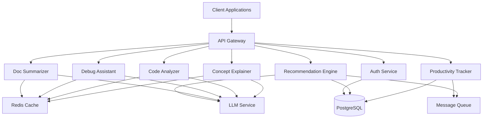

# Design Document: AI-powered Learning and Developer Productivity Assistant

## Overview

The AI-powered Learning and Developer Productivity Assistant is a cloud-based, microservices-oriented system that leverages large language models (LLMs) to provide intelligent assistance for learning and development tasks. The system follows a modular architecture with six core modules: Concept Explainer, Code Analyzer, Debug Assistant, Documentation Summarizer, Productivity Tracker, and Recommendation Engine.

The system is designed for high availability, scalability, and security, with a focus on providing fast, accurate responses to user queries while maintaining user privacy and data security.

## Architecture

### High-Level Architecture

The system follows a microservices architecture with the following layers:

1. **API Gateway Layer**: Handles authentication, rate limiting, and request routing
2. **Service Layer**: Six independent microservices for core functionality
3. **AI Model Layer**: LLM integration with caching and fallback mechanisms
4. **Data Layer**: Distributed database for user data, metrics, and knowledge base
5. **Cache Layer**: Redis for response caching and session management
6. **Message Queue**: Asynchronous processing for analytics and recommendations



### Technology Stack

- **API Gateway**: Kong or AWS API Gateway
- **Backend Services**: Node.js with TypeScript (for I/O-bound operations) or Python (for ML-heavy operations)
- **LLM Integration**: OpenAI API, Anthropic Claude, or self-hosted models via vLLM
- **Database**: PostgreSQL for structured data, with read replicas for scalability
- **Cache**: Redis for session management and response caching
- **Message Queue**: RabbitMQ or AWS SQS for asynchronous processing
- **Container Orchestration**: Kubernetes for service deployment and scaling
- **Monitoring**: Prometheus + Grafana for metrics, ELK stack for logging

### Deployment Strategy

- **Cloud Provider**: AWS, GCP, or Azure
- **Container Registry**: Docker Hub or AWS ECR
- **CI/CD**: GitHub Actions or GitLab CI
- **Infrastructure as Code**: Terraform
- **Auto-scaling**: Horizontal Pod Autoscaler (HPA) based on CPU/memory and custom metrics
- **Load Balancing**: Application Load Balancer with health checks

## Components and Interfaces

### 1. API Gateway

**Responsibilities**:
- Request authentication and authorization
- Rate limiting (100 requests/minute per user)
- Request routing to appropriate services
- Response aggregation for composite queries
- TLS termination

**Interfaces**:
```typescript
interface APIGatewayConfig {
  rateLimits: {
    requestsPerMinute: number;
    burstSize: number;
  };
  authentication: {
    methods: ['api-key', 'oauth2'];
    tokenExpiry: number;
  };
  routes: RouteConfig[];
}

interface RouteConfig {
  path: string;
  method: HttpMethod;
  service: string;
  authRequired: boolean;
  rateLimit?: number;
}
```

### 2. Concept Explainer Service

**Responsibilities**:
- Process concept explanation requests
- Generate clear, structured explanations with examples
- Identify prerequisite concepts
- Handle follow-up clarification requests
- Cache common explanations

**API Endpoints**:
```typescript
POST /api/v1/concepts/explain
Request: {
  concept: string;
  context?: string;
  detailLevel?: 'basic' | 'intermediate' | 'advanced';
  includeExamples?: boolean;
}
Response: {
  explanation: string;
  examples: string[];
  prerequisites: string[];
  relatedConcepts: string[];
  confidence: number;
  sources?: string[];
}

POST /api/v1/concepts/clarify
Request: {
  conversationId: string;
  question: string;
}
Response: {
  clarification: string;
  additionalExamples?: string[];
}
```

**Internal Components**:
- **Query Processor**: Parses and normalizes concept queries
- **Context Builder**: Builds context from conversation history
- **LLM Orchestrator**: Manages LLM requests with retry logic
- **Response Formatter**: Structures LLM output into consistent format
- **Cache Manager**: Handles caching of common explanations

### 3. Code Analyzer Service

**Responsibilities**:
- Detect programming language automatically
- Parse and analyze code structure
- Generate explanations of code logic and purpose
- Identify code quality issues
- Highlight complex patterns

**API Endpoints**:
```typescript
POST /api/v1/code/analyze
Request: {
  code: string;
  language?: string;
  analysisType?: 'explain' | 'quality' | 'full';
  focusAreas?: string[];
}
Response: {
  language: string;
  explanation: {
    purpose: string;
    logicFlow: string;
    keyComponents: Component[];
  };
  qualityIssues: QualityIssue[];
  complexity: {
    cyclomaticComplexity: number;
    cognitiveComplexity: number;
  };
  patterns: Pattern[];
}

interface Component {
  type: 'function' | 'class' | 'variable' | 'import';
  name: string;
  description: string;
  lineRange: [number, number];
}

interface QualityIssue {
  severity: 'low' | 'medium' | 'high' | 'critical';
  type: string;
  message: string;
  line: number;
  suggestion?: string;
}

interface Pattern {
  name: string;
  description: string;
  location: [number, number];
}
```

**Internal Components**:
- **Language Detector**: Uses heuristics and tree-sitter for language detection
- **AST Parser**: Parses code into abstract syntax tree
- **Static Analyzer**: Performs static analysis for quality issues
- **Pattern Recognizer**: Identifies design patterns and idioms
- **Explanation Generator**: Uses LLM to generate human-readable explanations

### 4. Debug Assistant Service

**Responsibilities**:
- Analyze code for potential bugs
- Generate structured bug reports
- Prioritize issues by severity and likelihood
- Provide fix suggestions with code examples
- Suggest edge cases and improvements

**API Endpoints**:
```typescript
POST /api/v1/debug/analyze
Request: {
  code: string;
  language?: string;
  errorMessage?: string;
  stackTrace?: string;
  expectedBehavior?: string;
  actualBehavior?: string;
}
Response: {
  bugs: BugReport[];
  suggestions: Suggestion[];
  edgeCases: string[];
}

interface BugReport {
  id: string;
  severity: 'low' | 'medium' | 'high' | 'critical';
  likelihood: number;
  type: 'runtime' | 'logical' | 'performance' | 'security';
  location: {
    line: number;
    column?: number;
    snippet: string;
  };
  description: string;
  cause: string;
  fixes: Fix[];
}

interface Fix {
  description: string;
  codeExample: string;
  tradeoffs?: string;
}

interface Suggestion {
  type: 'improvement' | 'edge-case' | 'best-practice';
  description: string;
  priority: number;
}
```

**Internal Components**:
- **Error Analyzer**: Parses error messages and stack traces
- **Bug Detector**: Uses static analysis and LLM to identify bugs
- **Prioritizer**: Ranks bugs by severity and likelihood
- **Fix Generator**: Generates fix suggestions with code examples

### 5. Documentation Summarizer Service

**Responsibilities**:
- Parse documentation in multiple formats
- Generate summaries preserving technical details
- Create hierarchical summaries for long documents
- Highlight critical warnings and deprecations
- Support custom summary lengths

**API Endpoints**:
```typescript
POST /api/v1/docs/summarize
Request: {
  content: string;
  format: 'markdown' | 'html' | 'plaintext' | 'pdf';
  summaryLength?: 'short' | 'medium' | 'long' | number;
  preserveDetails?: string[];
}
Response: {
  summary: string;
  sections?: Section[];
  keyPoints: string[];
  warnings: string[];
  apiSignatures: string[];
  estimatedReadingTime: number;
}

interface Section {
  title: string;
  summary: string;
  importance: number;
}
```

**Internal Components**:
- **Format Parser**: Converts various formats to normalized text
- **Content Extractor**: Extracts key information (APIs, warnings, etc.)
- **Summarization Engine**: Uses LLM with custom prompts for summarization
- **Hierarchy Builder**: Creates hierarchical summaries for long documents

### 6. Productivity Tracker Service

**Responsibilities**:
- Track user sessions and activities
- Calculate productivity metrics
- Store historical data
- Generate productivity reports and visualizations
- Detect productivity patterns

**API Endpoints**:
```typescript
POST /api/v1/productivity/session/start
Request: {
  userId: string;
  context?: string;
}
Response: {
  sessionId: string;
  startTime: string;
}

POST /api/v1/productivity/session/end
Request: {
  sessionId: string;
  activities: Activity[];
}
Response: {
  metrics: SessionMetrics;
}

GET /api/v1/productivity/dashboard
Query: {
  userId: string;
  timeRange: 'day' | 'week' | 'month' | 'custom';
  startDate?: string;
  endDate?: string;
}
Response: {
  metrics: ProductivityMetrics;
  trends: Trend[];
  visualizations: Visualization[];
}

interface Activity {
  type: 'learning' | 'coding' | 'debugging' | 'reading';
  duration: number;
  details: Record<string, any>;
}

interface SessionMetrics {
  duration: number;
  activitiesCompleted: number;
  conceptsLearned: number;
  codeAnalyzed: number;
  bugsFixed: number;
  docsReviewed: number;
}

interface ProductivityMetrics {
  totalTime: number;
  activeTime: number;
  breakdown: Record<string, number>;
  daily: DailyMetrics[];
  weekly: WeeklyMetrics[];
  monthly: MonthlyMetrics[];
}

interface Trend {
  metric: string;
  direction: 'up' | 'down' | 'stable';
  change: number;
  period: string;
}
```

**Internal Components**:
- **Session Manager**: Tracks active sessions
- **Metrics Calculator**: Computes productivity metrics
- **Data Aggregator**: Aggregates metrics by time period
- **Visualization Generator**: Creates charts and graphs
- **Pattern Detector**: Identifies productivity patterns

### 7. Recommendation Engine Service

**Responsibilities**:
- Analyze user activity patterns
- Generate personalized learning recommendations
- Create learning paths
- Suggest productivity improvements
- Track recommendation outcomes

**API Endpoints**:
```typescript
GET /api/v1/recommendations/learning
Query: {
  userId: string;
  limit?: number;
}
Response: {
  recommendations: LearningRecommendation[];
  learningPath: LearningPath;
}

GET /api/v1/recommendations/productivity
Query: {
  userId: string;
}
Response: {
  recommendations: ProductivityRecommendation[];
  insights: string[];
}

POST /api/v1/recommendations/feedback
Request: {
  recommendationId: string;
  userId: string;
  outcome: 'helpful' | 'not-helpful' | 'completed';
  feedback?: string;
}
Response: {
  success: boolean;
}

interface LearningRecommendation {
  id: string;
  concept: string;
  reason: string;
  priority: number;
  estimatedTime: number;
  prerequisites: string[];
  resources: Resource[];
}

interface LearningPath {
  topics: string[];
  estimatedDuration: number;
  currentProgress: number;
}

interface ProductivityRecommendation {
  id: string;
  type: 'workflow' | 'time-management' | 'skill-development';
  suggestion: string;
  expectedImpact: string;
  priority: number;
}

interface Resource {
  type: 'article' | 'video' | 'tutorial' | 'documentation';
  title: string;
  url: string;
  difficulty: string;
}
```

**Internal Components**:
- **Activity Analyzer**: Analyzes user activity patterns
- **Skill Assessor**: Estimates user skill levels
- **Gap Identifier**: Identifies knowledge gaps
- **Path Generator**: Creates personalized learning paths
- **Outcome Tracker**: Tracks recommendation effectiveness

### 8. Authentication Service

**Responsibilities**:
- User registration and login
- Token generation and validation
- Password management
- Account security (lockout, 2FA)
- Data export and deletion

**API Endpoints**:
```typescript
POST /api/v1/auth/register
Request: {
  email: string;
  password: string;
  name: string;
}
Response: {
  userId: string;
  token: string;
}

POST /api/v1/auth/login
Request: {
  email: string;
  password: string;
}
Response: {
  token: string;
  refreshToken: string;
  expiresIn: number;
}

POST /api/v1/auth/logout
Request: {
  token: string;
}
Response: {
  success: boolean;
}

GET /api/v1/user/data/export
Response: {
  data: UserData;
  format: 'json';
}

DELETE /api/v1/user/data
Response: {
  scheduledDeletion: string;
}
```

## Data Models

### User Model
```typescript
interface User {
  id: string;
  email: string;
  passwordHash: string;
  name: string;
  createdAt: Date;
  lastLoginAt: Date;
  preferences: UserPreferences;
  skillLevel: SkillLevel;
  interests: string[];
  goals: string[];
  accountStatus: 'active' | 'locked' | 'deleted';
  failedLoginAttempts: number;
  lastFailedLoginAt?: Date;
}

interface UserPreferences {
  defaultDetailLevel: 'basic' | 'intermediate' | 'advanced';
  preferredLanguages: string[];
  notificationsEnabled: boolean;
  theme: 'light' | 'dark';
}

interface SkillLevel {
  overall: number;
  byTopic: Record<string, number>;
}
```

### Session Model
```typescript
interface Session {
  id: string;
  userId: string;
  startTime: Date;
  endTime?: Date;
  context?: string;
  activities: Activity[];
  metrics: SessionMetrics;
}
```

### Conversation Model
```typescript
interface Conversation {
  id: string;
  userId: string;
  type: 'concept' | 'code' | 'debug' | 'docs';
  messages: Message[];
  createdAt: Date;
  updatedAt: Date;
}

interface Message {
  id: string;
  role: 'user' | 'assistant';
  content: string;
  timestamp: Date;
  metadata?: Record<string, any>;
}
```

### Recommendation Model
```typescript
interface Recommendation {
  id: string;
  userId: string;
  type: 'learning' | 'productivity';
  content: LearningRecommendation | ProductivityRecommendation;
  createdAt: Date;
  status: 'pending' | 'accepted' | 'rejected' | 'completed';
  outcome?: {
    feedback: string;
    helpful: boolean;
    completedAt?: Date;
  };
}
```

### Feedback Model
```typescript
interface Feedback {
  id: string;
  userId: string;
  responseId: string;
  serviceType: string;
  rating: number;
  comment?: string;
  createdAt: Date;
  flaggedForReview: boolean;
}
```

### Cache Entry Model
```typescript
interface CacheEntry {
  key: string;
  value: any;
  ttl: number;
  createdAt: Date;
  accessCount: number;
  lastAccessedAt: Date;
}
```

### Database Schema

```sql
-- Users table
CREATE TABLE users (
  id UUID PRIMARY KEY DEFAULT gen_random_uuid(),
  email VARCHAR(255) UNIQUE NOT NULL,
  password_hash VARCHAR(255) NOT NULL,
  name VARCHAR(255) NOT NULL,
  created_at TIMESTAMP DEFAULT CURRENT_TIMESTAMP,
  last_login_at TIMESTAMP,
  preferences JSONB DEFAULT '{}',
  skill_level JSONB DEFAULT '{}',
  interests TEXT[] DEFAULT '{}',
  goals TEXT[] DEFAULT '{}',
  account_status VARCHAR(50) DEFAULT 'active',
  failed_login_attempts INTEGER DEFAULT 0,
  last_failed_login_at TIMESTAMP
);

CREATE INDEX idx_users_email ON users(email);
CREATE INDEX idx_users_account_status ON users(account_status);

-- Sessions table
CREATE TABLE sessions (
  id UUID PRIMARY KEY DEFAULT gen_random_uuid(),
  user_id UUID REFERENCES users(id) ON DELETE CASCADE,
  start_time TIMESTAMP NOT NULL,
  end_time TIMESTAMP,
  context TEXT,
  activities JSONB DEFAULT '[]',
  metrics JSONB DEFAULT '{}'
);

CREATE INDEX idx_sessions_user_id ON sessions(user_id);
CREATE INDEX idx_sessions_start_time ON sessions(start_time);

-- Conversations table
CREATE TABLE conversations (
  id UUID PRIMARY KEY DEFAULT gen_random_uuid(),
  user_id UUID REFERENCES users(id) ON DELETE CASCADE,
  type VARCHAR(50) NOT NULL,
  messages JSONB DEFAULT '[]',
  created_at TIMESTAMP DEFAULT CURRENT_TIMESTAMP,
  updated_at TIMESTAMP DEFAULT CURRENT_TIMESTAMP
);

CREATE INDEX idx_conversations_user_id ON conversations(user_id);
CREATE INDEX idx_conversations_type ON conversations(type);

-- Recommendations table
CREATE TABLE recommendations (
  id UUID PRIMARY KEY DEFAULT gen_random_uuid(),
  user_id UUID REFERENCES users(id) ON DELETE CASCADE,
  type VARCHAR(50) NOT NULL,
  content JSONB NOT NULL,
  created_at TIMESTAMP DEFAULT CURRENT_TIMESTAMP,
  status VARCHAR(50) DEFAULT 'pending',
  outcome JSONB
);

CREATE INDEX idx_recommendations_user_id ON recommendations(user_id);
CREATE INDEX idx_recommendations_status ON recommendations(status);

-- Feedback table
CREATE TABLE feedback (
  id UUID PRIMARY KEY DEFAULT gen_random_uuid(),
  user_id UUID REFERENCES users(id) ON DELETE CASCADE,
  response_id VARCHAR(255) NOT NULL,
  service_type VARCHAR(50) NOT NULL,
  rating INTEGER CHECK (rating >= 1 AND rating <= 5),
  comment TEXT,
  created_at TIMESTAMP DEFAULT CURRENT_TIMESTAMP,
  flagged_for_review BOOLEAN DEFAULT FALSE
);

CREATE INDEX idx_feedback_user_id ON feedback(user_id);
CREATE INDEX idx_feedback_flagged ON feedback(flagged_for_review);
CREATE INDEX idx_feedback_service_type ON feedback(service_type);
```


## Correctness Properties

*A property is a characteristic or behavior that should hold true across all valid executions of a system—essentially, a formal statement about what the system should do. Properties serve as the bridge between human-readable specifications and machine-verifiable correctness guarantees.*

### Service Response Properties

**Property 1: Service response time SLA compliance**
*For any* valid request to Concept Explainer, Code Analyzer, Doc Summarizer, or Productivity Dashboard, the response time should meet the specified SLA (5s for concepts, 10s for code analysis, 10s for doc summarization, 2s for dashboard) for at least 95% of requests.
**Validates: Requirements 1.1, 4.1, 5.5, 8.1, 8.2**

**Property 2: Response completeness**
*For any* successful service response, the response should contain all required fields as specified in the API contract (e.g., explanations include examples and analogies, bug reports include location and fixes, summaries preserve API signatures).
**Validates: Requirements 1.2, 2.3, 3.2, 3.4, 4.2**

### Code Analysis Properties

**Property 3: Language detection accuracy**
*For any* valid code snippet in a supported language, the Code Analyzer should correctly identify the programming language.
**Validates: Requirements 2.2**

**Property 4: Code parsing success**
*For any* syntactically valid code snippet, the Code Analyzer should successfully parse and return a structured analysis without errors.
**Validates: Requirements 2.1**

**Property 5: Pattern detection**
*For any* code snippet containing known design patterns, the Code Analyzer should identify and explain at least the most prominent patterns.
**Validates: Requirements 2.4**

**Property 6: Quality issue severity assignment**
*For any* detected code quality issue, the issue should be assigned a valid severity level (low, medium, high, critical) and issues should be orderable by severity.
**Validates: Requirements 2.5**

### Debugging Properties

**Property 7: Bug detection capability**
*For any* code snippet with known bugs, the Debug Assistant should identify at least one issue in its analysis.
**Validates: Requirements 3.1**

**Property 8: Bug prioritization ordering**
*For any* set of detected bugs, the bugs should be ordered such that higher severity bugs appear before lower severity bugs, and within the same severity, higher likelihood bugs appear first.
**Validates: Requirements 3.3**

### Documentation Properties

**Property 9: Hierarchical summary structure**
*For any* documentation exceeding 10,000 words, the generated summary should include a hierarchical structure with multiple sections.
**Validates: Requirements 4.3**

**Property 10: Summary length compliance**
*For any* documentation with a specified summary length constraint, the generated summary should respect the length constraint (within 20% tolerance).
**Validates: Requirements 4.4**

**Property 11: Warning preservation**
*For any* documentation containing warnings or deprecations, the summary should explicitly highlight these critical items.
**Validates: Requirements 4.6**

### Productivity Tracking Properties

**Property 12: Session lifecycle tracking**
*For any* session, starting the session should create a record with a timestamp, and ending the session should calculate and store metrics including duration and activity counts.
**Validates: Requirements 5.1, 5.2**

**Property 13: Activity categorization**
*For any* recorded activity, the activity should be categorized into one of the valid types (learning, coding, debugging, reading) and have a non-negative duration.
**Validates: Requirements 5.3**

**Property 14: Metric completeness**
*For any* completed session, the stored metrics should include all required fields: concepts learned, code analyzed, bugs fixed, and documentation reviewed.
**Validates: Requirements 5.6**

**Property 15: Trend calculation accuracy**
*For any* set of historical sessions, calculated trends (daily, weekly, monthly) should accurately aggregate the underlying session data.
**Validates: Requirements 5.4**

**Property 16: Dashboard visualization presence**
*For any* productivity dashboard response, the response should include visualization data (charts/graphs) in addition to raw metrics.
**Validates: Requirements 5.7**

### Recommendation Properties

**Property 17: Recommendation personalization**
*For any* two users with different skill levels, interests, or goals, the generated recommendations should differ in content or priority.
**Validates: Requirements 6.2**

**Property 18: Learning path generation**
*For any* user, the Recommendation Engine should generate a learning path with at least one topic, and topics should be ordered by priority.
**Validates: Requirements 6.6**

**Property 19: Recommendation feedback loop**
*For any* recommendation that is marked as completed or helpful, subsequent recommendation requests should reflect this feedback in the recommendation algorithm.
**Validates: Requirements 6.5**

**Property 20: Gap-based recommendations**
*For any* user with identified knowledge gaps, at least one learning recommendation should address a gap from their profile.
**Validates: Requirements 6.3**

**Property 21: Productivity-based recommendations**
*For any* user with tracked productivity metrics showing inefficiency patterns, at least one productivity recommendation should be generated.
**Validates: Requirements 6.4, 6.7**

### Authentication and Security Properties

**Property 22: Credential strength validation**
*For any* registration attempt with weak credentials (e.g., password < 8 characters, no special characters), the system should reject the registration.
**Validates: Requirements 7.1**

**Property 23: Account lockout behavior**
*For any* user account, three consecutive failed login attempts should result in the account being locked for at least 15 minutes.
**Validates: Requirements 7.6**

**Property 24: Data deletion compliance**
*For any* user data deletion request, all associated user data should be marked for deletion and removed from queryable datasets.
**Validates: Requirements 7.4**

**Property 25: Data export completeness**
*For any* user data export request, the exported JSON should contain all user data including profile, sessions, conversations, and recommendations.
**Validates: Requirements 7.7**

### Retry and Caching Properties

**Property 26: Retry with exponential backoff**
*For any* failed AI model request, the system should retry up to 3 times with exponentially increasing delays between attempts.
**Validates: Requirements 8.6**

**Property 27: Cache hit behavior**
*For any* identical request made within the cache TTL period, the second request should be served from cache and return the same result faster than the first request.
**Validates: Requirements 8.7**

### API Properties

**Property 28: Authentication enforcement**
*For any* API request without valid authentication credentials, the system should return a 401 Unauthorized error.
**Validates: Requirements 9.5**

**Property 29: Rate limiting enforcement**
*For any* user making more than 100 requests per minute, subsequent requests should return a 429 Too Many Requests error.
**Validates: Requirements 9.6**

**Property 30: Error response consistency**
*For any* error condition, the error response should follow a consistent JSON structure with an error code, message, and optional details field.
**Validates: Requirements 9.7**

**Property 31: Webhook triggering**
*For any* productivity milestone event, a webhook should be triggered with the milestone details.
**Validates: Requirements 9.4**

### Content Quality Properties

**Property 32: Source citation presence**
*For any* explanation response where sources are available, the response should include source citations.
**Validates: Requirements 10.1**

**Property 33: Uncertainty indication**
*For any* AI model response with confidence below 70%, the response should include an explicit uncertainty indicator.
**Validates: Requirements 10.2**

**Property 34: Feedback recording**
*For any* user feedback submission, the feedback should be stored with the response ID, rating, and timestamp.
**Validates: Requirements 10.3**

**Property 35: Negative feedback flagging**
*For any* feedback with a rating below 3 or marked as unhelpful, the associated response should be flagged for review.
**Validates: Requirements 10.4**

**Property 36: Security vulnerability avoidance**
*For any* generated code snippet, the code should not contain known security vulnerabilities from the OWASP Top 10 list.
**Validates: Requirements 10.7**

### Context Maintenance Properties

**Property 37: Conversation context preservation**
*For any* clarification request within a conversation, the response should reference or build upon the previous messages in the conversation.
**Validates: Requirements 1.4**

**Property 38: Prerequisite identification**
*For any* concept with known prerequisites, the explanation should list at least the immediate prerequisites.
**Validates: Requirements 1.3**

## Error Handling

### Error Categories

The system handles four categories of errors:

1. **Client Errors (4xx)**: Invalid requests, authentication failures, rate limiting
2. **Server Errors (5xx)**: Internal failures, service unavailability, timeout errors
3. **AI Model Errors**: Model unavailability, low confidence, context length exceeded
4. **Data Errors**: Database failures, cache misses, data corruption

### Error Handling Strategies

#### 1. Input Validation Errors
- **Trigger**: Invalid or malformed request data
- **Response**: 400 Bad Request with detailed validation errors
- **Example**:
```json
{
  "error": {
    "code": "INVALID_REQUEST",
    "message": "Request validation failed",
    "details": [
      {
        "field": "code",
        "issue": "Code snippet cannot be empty"
      }
    ]
  }
}
```

#### 2. Authentication Errors
- **Trigger**: Missing, invalid, or expired authentication credentials
- **Response**: 401 Unauthorized
- **Action**: Client must re-authenticate
- **Example**:
```json
{
  "error": {
    "code": "UNAUTHORIZED",
    "message": "Invalid or expired authentication token"
  }
}
```

#### 3. Rate Limiting Errors
- **Trigger**: User exceeds rate limit (100 requests/minute)
- **Response**: 429 Too Many Requests with Retry-After header
- **Action**: Client should implement exponential backoff
- **Example**:
```json
{
  "error": {
    "code": "RATE_LIMIT_EXCEEDED",
    "message": "Rate limit exceeded. Please retry after 60 seconds",
    "retryAfter": 60
  }
}
```

#### 4. AI Model Errors
- **Trigger**: LLM service unavailable, timeout, or error
- **Strategy**: Retry up to 3 times with exponential backoff (1s, 2s, 4s)
- **Fallback**: Return cached response if available, otherwise return error
- **Response**: 503 Service Unavailable if all retries fail
- **Example**:
```json
{
  "error": {
    "code": "AI_SERVICE_UNAVAILABLE",
    "message": "AI service temporarily unavailable. Please try again later",
    "retryable": true
  }
}
```

#### 5. Low Confidence Responses
- **Trigger**: AI model confidence < 70%
- **Strategy**: Return response with uncertainty indicator
- **Response**: 200 OK with warning field
- **Example**:
```json
{
  "explanation": "...",
  "confidence": 0.65,
  "warning": "This explanation has lower confidence. Please verify with additional sources."
}
```

#### 6. Database Errors
- **Trigger**: Database connection failure, query timeout, constraint violation
- **Strategy**: 
  - Read operations: Retry up to 3 times, use read replica if primary fails
  - Write operations: Return error immediately, log for manual intervention
- **Response**: 503 Service Unavailable for transient errors, 500 Internal Server Error for persistent errors

#### 7. Cache Errors
- **Trigger**: Redis unavailable or cache miss
- **Strategy**: Degrade gracefully, fetch from source (database or AI model)
- **Impact**: Increased latency but no functionality loss
- **Logging**: Log cache failures for monitoring

#### 8. Timeout Errors
- **Trigger**: Request processing exceeds timeout threshold
- **Timeouts**:
  - Concept explanation: 5 seconds
  - Code analysis: 10 seconds
  - Doc summarization: 10 seconds
  - Dashboard: 2 seconds
- **Response**: 504 Gateway Timeout
- **Example**:
```json
{
  "error": {
    "code": "REQUEST_TIMEOUT",
    "message": "Request processing exceeded timeout limit",
    "timeout": 5000
  }
}
```

#### 9. Resource Not Found
- **Trigger**: Requested resource (user, session, conversation) doesn't exist
- **Response**: 404 Not Found
- **Example**:
```json
{
  "error": {
    "code": "RESOURCE_NOT_FOUND",
    "message": "Session not found",
    "resourceType": "session",
    "resourceId": "abc-123"
  }
}
```

#### 10. Data Validation Errors
- **Trigger**: Data integrity constraints violated
- **Response**: 422 Unprocessable Entity
- **Example**:
```json
{
  "error": {
    "code": "VALIDATION_ERROR",
    "message": "Data validation failed",
    "details": [
      {
        "field": "email",
        "issue": "Email already registered"
      }
    ]
  }
}
```

### Error Logging and Monitoring

All errors are logged with:
- Timestamp
- Error type and code
- User ID (if authenticated)
- Request ID for tracing
- Stack trace (for server errors)
- Context information

Critical errors trigger alerts:
- AI model unavailability > 5 minutes
- Database connection failures
- Error rate > 5% of requests
- Response time SLA violations

## Testing Strategy

### Overview

The testing strategy employs a dual approach combining unit tests for specific examples and edge cases with property-based tests for universal correctness properties. This ensures both concrete behavior validation and comprehensive input coverage.

### Testing Frameworks

**Unit Testing**:
- **JavaScript/TypeScript**: Jest
- **Python**: pytest
- **Integration**: Supertest (API testing)

**Property-Based Testing**:
- **JavaScript/TypeScript**: fast-check
- **Python**: Hypothesis

**Load Testing**:
- **Tool**: k6 or Apache JMeter
- **Scenarios**: Concurrent users, sustained load, spike testing

### Unit Testing Approach

Unit tests focus on:
1. **Specific examples**: Concrete test cases with known inputs and outputs
2. **Edge cases**: Boundary conditions, empty inputs, maximum sizes
3. **Error conditions**: Invalid inputs, service failures, timeout scenarios
4. **Integration points**: Service-to-service communication, database operations

**Example Unit Tests**:
```typescript
describe('Concept Explainer', () => {
  it('should explain a basic programming concept', async () => {
    const result = await conceptExplainer.explain('recursion');
    expect(result.explanation).toBeDefined();
    expect(result.examples.length).toBeGreaterThan(0);
  });

  it('should handle empty concept query', async () => {
    await expect(conceptExplainer.explain('')).rejects.toThrow('Concept cannot be empty');
  });

  it('should identify prerequisites for advanced concepts', async () => {
    const result = await conceptExplainer.explain('dynamic programming');
    expect(result.prerequisites).toContain('recursion');
  });
});
```

### Property-Based Testing Approach

Property tests validate universal properties across randomly generated inputs. Each test runs a minimum of 100 iterations to ensure comprehensive coverage.

**Configuration**:
- Minimum iterations: 100 per property test
- Seed: Configurable for reproducibility
- Shrinking: Enabled to find minimal failing cases

**Property Test Structure**:
Each property test must:
1. Reference the design document property number
2. Use the tag format: `Feature: ai-learning-productivity-assistant, Property {N}: {property_text}`
3. Generate diverse, valid inputs
4. Assert the universal property holds

**Example Property Tests**:

```typescript
// Feature: ai-learning-productivity-assistant, Property 1: Service response time SLA compliance
describe('Property 1: Response time SLA', () => {
  it('should respond to concept queries within 5 seconds for 95% of requests', async () => {
    await fc.assert(
      fc.asyncProperty(
        fc.string({ minLength: 1, maxLength: 100 }), // Random concept queries
        async (concept) => {
          const startTime = Date.now();
          await conceptExplainer.explain(concept);
          const duration = Date.now() - startTime;
          return duration < 5000;
        }
      ),
      { numRuns: 100, endOnFailure: false }
    );
    
    // Verify 95th percentile
    const responseTimes = /* collect from test runs */;
    const p95 = percentile(responseTimes, 95);
    expect(p95).toBeLessThan(5000);
  });
});

// Feature: ai-learning-productivity-assistant, Property 3: Language detection accuracy
describe('Property 3: Language detection', () => {
  it('should correctly identify programming language for valid code', async () => {
    await fc.assert(
      fc.asyncProperty(
        fc.record({
          language: fc.constantFrom('python', 'javascript', 'java', 'go'),
          code: fc.string({ minLength: 10 })
        }),
        async ({ language, code }) => {
          const codeSnippet = generateValidCode(language, code);
          const result = await codeAnalyzer.analyze(codeSnippet);
          return result.language === language;
        }
      ),
      { numRuns: 100 }
    );
  });
});

// Feature: ai-learning-productivity-assistant, Property 8: Bug prioritization ordering
describe('Property 8: Bug prioritization', () => {
  it('should order bugs by severity then likelihood', async () => {
    await fc.assert(
      fc.asyncProperty(
        fc.array(fc.record({
          code: fc.string(),
          bugType: fc.constantFrom('runtime', 'logical', 'performance')
        }), { minLength: 2, maxLength: 5 }),
        async (testCases) => {
          const results = await Promise.all(
            testCases.map(tc => debugAssistant.analyze(tc.code))
          );
          
          const allBugs = results.flatMap(r => r.bugs);
          
          // Verify ordering: higher severity before lower severity
          for (let i = 0; i < allBugs.length - 1; i++) {
            const current = allBugs[i];
            const next = allBugs[i + 1];
            
            if (severityValue(current.severity) < severityValue(next.severity)) {
              return false;
            }
            
            // Within same severity, higher likelihood first
            if (current.severity === next.severity && 
                current.likelihood < next.likelihood) {
              return false;
            }
          }
          
          return true;
        }
      ),
      { numRuns: 100 }
    );
  });
});

// Feature: ai-learning-productivity-assistant, Property 12: Session lifecycle tracking
describe('Property 12: Session lifecycle', () => {
  it('should track session start and end with metrics', async () => {
    await fc.assert(
      fc.asyncProperty(
        fc.record({
          userId: fc.uuid(),
          activities: fc.array(fc.record({
            type: fc.constantFrom('learning', 'coding', 'debugging', 'reading'),
            duration: fc.integer({ min: 1, max: 3600 })
          }), { minLength: 1, maxLength: 10 })
        }),
        async ({ userId, activities }) => {
          // Start session
          const session = await productivityTracker.startSession(userId);
          expect(session.startTime).toBeDefined();
          
          // End session with activities
          const result = await productivityTracker.endSession(session.id, activities);
          
          // Verify metrics calculated
          expect(result.metrics.duration).toBeGreaterThan(0);
          expect(result.metrics.activitiesCompleted).toBe(activities.length);
          
          return true;
        }
      ),
      { numRuns: 100 }
    );
  });
});

// Feature: ai-learning-productivity-assistant, Property 23: Account lockout behavior
describe('Property 23: Account lockout', () => {
  it('should lock account after 3 failed login attempts', async () => {
    await fc.assert(
      fc.asyncProperty(
        fc.record({
          email: fc.emailAddress(),
          correctPassword: fc.string({ minLength: 8 }),
          wrongPassword: fc.string({ minLength: 8 })
        }),
        async ({ email, correctPassword, wrongPassword }) => {
          // Create account
          await authService.register(email, correctPassword);
          
          // Attempt 3 failed logins
          for (let i = 0; i < 3; i++) {
            await expect(authService.login(email, wrongPassword)).rejects.toThrow();
          }
          
          // Verify account is locked
          await expect(authService.login(email, correctPassword))
            .rejects.toThrow('Account locked');
          
          return true;
        }
      ),
      { numRuns: 100 }
    );
  });
});

// Feature: ai-learning-productivity-assistant, Property 27: Cache hit behavior
describe('Property 27: Cache hit behavior', () => {
  it('should serve repeated requests from cache faster', async () => {
    await fc.assert(
      fc.asyncProperty(
        fc.string({ minLength: 1, maxLength: 100 }),
        async (concept) => {
          // First request
          const start1 = Date.now();
          const result1 = await conceptExplainer.explain(concept);
          const duration1 = Date.now() - start1;
          
          // Second request (should hit cache)
          const start2 = Date.now();
          const result2 = await conceptExplainer.explain(concept);
          const duration2 = Date.now() - start2;
          
          // Verify same result and faster response
          expect(result1).toEqual(result2);
          return duration2 < duration1;
        }
      ),
      { numRuns: 100 }
    );
  });
});

// Feature: ai-learning-productivity-assistant, Property 30: Error response consistency
describe('Property 30: Error response consistency', () => {
  it('should return consistent error format for all error types', async () => {
    await fc.assert(
      fc.asyncProperty(
        fc.constantFrom(
          { type: 'invalid_input', trigger: () => conceptExplainer.explain('') },
          { type: 'unauthorized', trigger: () => apiGateway.request('/api/concepts', null) },
          { type: 'not_found', trigger: () => productivityTracker.getSession('invalid-id') }
        ),
        async ({ type, trigger }) => {
          try {
            await trigger();
            return false; // Should have thrown
          } catch (error) {
            // Verify error structure
            expect(error.error).toBeDefined();
            expect(error.error.code).toBeDefined();
            expect(error.error.message).toBeDefined();
            expect(typeof error.error.code).toBe('string');
            expect(typeof error.error.message).toBe('string');
            return true;
          }
        }
      ),
      { numRuns: 100 }
    );
  });
});
```

### Integration Testing

Integration tests verify:
- End-to-end API flows
- Service-to-service communication
- Database transactions
- Cache behavior
- Authentication and authorization

**Example Integration Test**:
```typescript
describe('End-to-end concept explanation flow', () => {
  it('should handle complete concept explanation workflow', async () => {
    // Register and login
    const { token } = await request(app)
      .post('/api/v1/auth/register')
      .send({ email: 'test@example.com', password: 'SecurePass123!', name: 'Test User' });
    
    // Request concept explanation
    const response = await request(app)
      .post('/api/v1/concepts/explain')
      .set('Authorization', `Bearer ${token}`)
      .send({ concept: 'binary search tree' });
    
    expect(response.status).toBe(200);
    expect(response.body.explanation).toBeDefined();
    expect(response.body.examples.length).toBeGreaterThan(0);
    
    // Verify session tracking
    const dashboard = await request(app)
      .get('/api/v1/productivity/dashboard?timeRange=day')
      .set('Authorization', `Bearer ${token}`);
    
    expect(dashboard.body.metrics.conceptsLearned).toBeGreaterThan(0);
  });
});
```

### Load Testing

Load tests verify system performance under various conditions:

**Test Scenarios**:
1. **Baseline**: 100 concurrent users, 10 minutes
2. **Sustained Load**: 1000 concurrent users, 30 minutes
3. **Spike Test**: Ramp from 100 to 2000 users in 1 minute
4. **Stress Test**: Gradually increase load until system degrades

**Metrics to Monitor**:
- Response time (p50, p95, p99)
- Error rate
- Throughput (requests/second)
- Resource utilization (CPU, memory, database connections)
- Cache hit rate

**Example k6 Load Test**:
```javascript
import http from 'k6/http';
import { check, sleep } from 'k6';

export const options = {
  stages: [
    { duration: '2m', target: 100 },
    { duration: '5m', target: 1000 },
    { duration: '2m', target: 0 },
  ],
  thresholds: {
    http_req_duration: ['p(95)<5000'], // 95% of requests under 5s
    http_req_failed: ['rate<0.05'],    // Error rate under 5%
  },
};

export default function () {
  const payload = JSON.stringify({
    concept: 'recursion',
  });

  const params = {
    headers: {
      'Content-Type': 'application/json',
      'Authorization': `Bearer ${__ENV.API_TOKEN}`,
    },
  };

  const res = http.post('https://api.example.com/v1/concepts/explain', payload, params);
  
  check(res, {
    'status is 200': (r) => r.status === 200,
    'response time < 5s': (r) => r.timings.duration < 5000,
    'has explanation': (r) => JSON.parse(r.body).explanation !== undefined,
  });

  sleep(1);
}
```

### Test Coverage Goals

- **Unit Test Coverage**: Minimum 80% code coverage
- **Property Test Coverage**: All correctness properties implemented
- **Integration Test Coverage**: All API endpoints and critical flows
- **Load Test Coverage**: All performance-critical endpoints

### Continuous Testing

- **CI/CD Integration**: All tests run on every commit
- **Pre-deployment**: Full test suite including load tests
- **Production Monitoring**: Synthetic tests run every 5 minutes
- **Regression Testing**: Automated tests for all bug fixes

### Test Data Management

- **Unit Tests**: Use factories and fixtures for test data
- **Property Tests**: Use generators for random valid data
- **Integration Tests**: Use test database with seed data
- **Load Tests**: Use realistic data distributions based on production patterns

